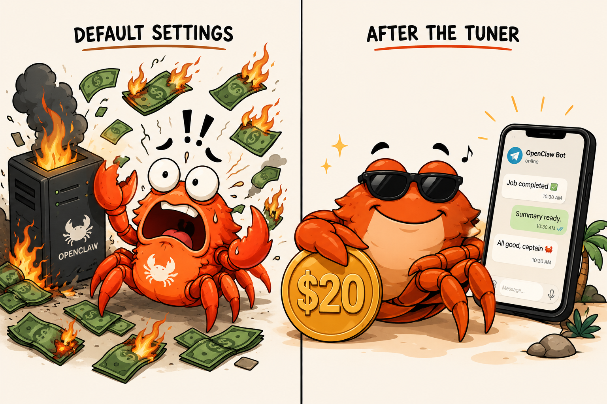

# openclaw-tune-codex-plus



> Make your OpenClaw Telegram bot fit on the $20 ChatGPT Plus Codex budget.

A one-command tuner that trims an OpenClaw bot's system-prompt budget, pins the Codex CLI to subscription mode, and removes the paid-per-token fallbacks that quietly drain your wallet.

## Why

Out of the box, an OpenClaw bot on ChatGPT Plus burns through the weekly Codex quota in days:

- Default heartbeat fires every 30 minutes — idle ticks are the single biggest avoidable drain, and on a Plus plan they're enough on their own to trip the weekly usage limit (`try again in ~N min`).
- A multi-file bootstrap (`AGENTS.md`, `MEMORY.md`, `TOOLS.md`, …) can run to tens of KB, reloaded as system prompt on every request.
- Default fallback chain includes `openai/gpt-4o-mini` — paid per-token, not subscription.
- Codex CLI silently downgrades to apikey mode if `OPENAI_API_KEY` is in container env, switching the bot from $20/mo flat to per-token billing.

## What this does

- Trims bootstrap so all 7 files stay well under the engine limits — 12 KB per file, 60 KB total (a tuned reference bot runs ~18 KB total)
- Sets `agents.defaults.heartbeat.every = "6h"`
- Pins Codex CLI to `forced_login_method = "chatgpt"`, `sandbox_mode = "danger-full-access"`, `approval_policy = "never"`
- Removes paid OpenAI fallback, keeps Gemini as a free safety net
- Locks Telegram channel to allowlist (DMs only from owner; groups disabled)
- Drops a `/limits` script you can run to see weekly Codex usage

## What it doesn't do

- Install OpenClaw or build the container — bring your own working bot.
- Register a Telegram bot with BotFather.
- Run the Codex OAuth login flow (`refresh-auth codex` is on you).
- Acquire a Gemini API key.

## Status

Public. Tested on a production bot (OpenClaw `2026.4.23`, Codex CLI `0.124.0`). Issues and PRs welcome.

## Quick start

```bash
git clone https://github.com/MOZARTINOS/openclaw-tune-codex-plus.git
cd openclaw-tune-codex-plus
./install.sh
```

The installer asks you 7 questions (SSH target, owner Telegram ID, timezone, bot name, …), saves your answers, then patches the remote bot. Re-running re-uses the saved answers — no prompts.

### Where to run it

Run the tuner from **your own machine or the Docker host** — whichever has `jq`, `node`, `ssh` and can reach the bot. **Do not run it from inside the OpenClaw container** (it has none of those, and no `config.json`).

- **Remote bot:** set `remote.host` in `config.json` (e.g. `root@your.server`) — the scripts SSH in to the host and run `docker exec` there.
- **Already on the Docker host:** leave `remote.host` empty (local mode) — the scripts call `docker exec` directly, so `docker` must be on your `PATH`.

You also need a `config.json` first — `./install.sh` creates one interactively, or `cp config.example.json config.json` and edit it. (`config.json` is gitignored on purpose; it holds your SSH target and Telegram ID.)

## Security model — read this before running

This tuner installs Codex CLI configs with **`sandbox_mode = "danger-full-access"`** and **`approval_policy = "never"`**. That's required because Codex CLI's `workspace-write` mode uses bwrap (Linux user namespaces), which fails inside non-privileged Docker. The trade-off: **whatever your bot can be talked into doing, it can do** — read any file inside the container, run any shell command, hit any host network reachable from the container.

In practice the **container is the security boundary**. The bot cannot escape Docker, but it can:

- Read every file under `/home/node/.openclaw/` (your bootstrap, memory, auth tokens, API keys in `.env`).
- Run arbitrary commands inside the container.
- Reach any network endpoint the container can route to (your LAN if bridged, the open internet, etc.).

So: **lock the Telegram allowlist tightly** (this tuner sets `dmPolicy: "allowlist"` and `groupPolicy: "disabled"` automatically), don't put long-lived credentials on the host that you wouldn't trust your bot with, and don't expose the container to the internet beyond Telegram.

**The allowlist shrinks the attack surface, but it is not a sandbox.** With `exec` enabled, anyone the allowlist trusts effectively has a full shell inside the container. The tuner also denies the high-blast-radius tools it doesn't need (`image`, `image_generate`, `code_execution`, `browser`, `x_search`) — but defense-in-depth is not isolation. Treat the container as compromised-on-prompt-injection.

**Don't put secrets in the bootstrap.** Anything in `MEMORY.md`, `AGENTS.md`, or the rest of `workspace/` is readable by a bot with full file access — never paste API keys, tokens, or passwords there. And when you share a config or a log for debugging, redact tokens, Telegram IDs, IPs, and hostnames first.

The reference deployment ran the container **non-privileged** — `CapEff=0`, with `SYS_ADMIN` / `NET_ADMIN` / `SYS_PTRACE` / `SYS_RAWIO` / `SYS_MODULE` all false — which is what keeps "the container is the boundary" honest. OpenClaw's own security audit will still warn `Exec security=full is configured`; with this setup that warning is expected.

If your threat model can't tolerate this, don't use this tool — pick a different sandbox or run OpenClaw in a privileged-but-isolated VM.

## Requirements

- Linux server with Docker and a working `openclaw` container
- OpenClaw image `≥ 2026.4.22`
- Codex CLI `≥ 0.124.0` inside the container
- Local: `bash`, `jq`, `node`, `ssh`, `scp`

## Compatibility

Verified against a reference deployment that ran for a month:

| Component | Tested |
|---|---|
| OpenClaw | app `2026.4.23` (min `2026.4.22`) |
| Codex CLI | `0.124.0` |
| Node (in container) | `24.x` |
| Host OS | Linux x86-64 (6.8 kernel) |
| Docker | non-privileged (`CapEff=0`) |
| Local deps | `bash`, `jq`, `node`, `ssh`, `scp` |
| Channel | Telegram ✓ — WhatsApp / Discord not tuned or tested |

Scripts assume **`bash`** (they use `set -o pipefail`); they will not run under a POSIX `sh`.

## License

MIT — see [LICENSE](LICENSE).
